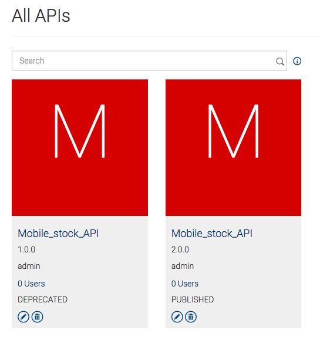
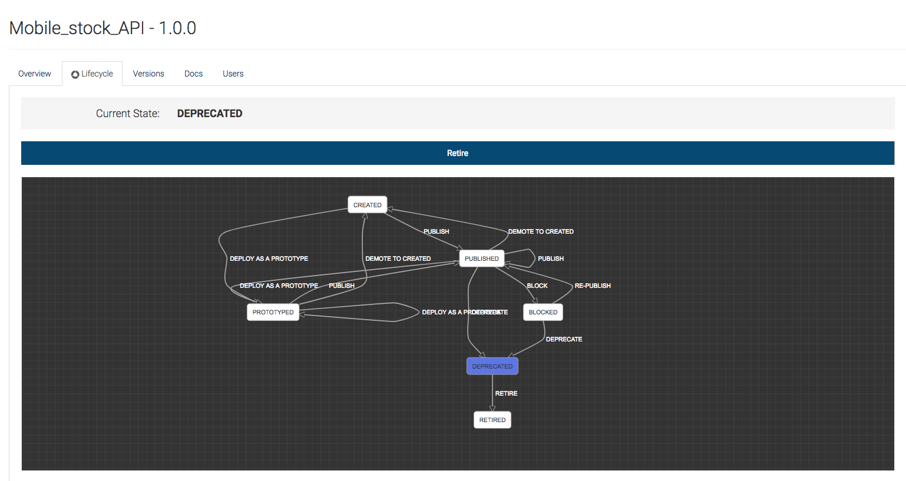
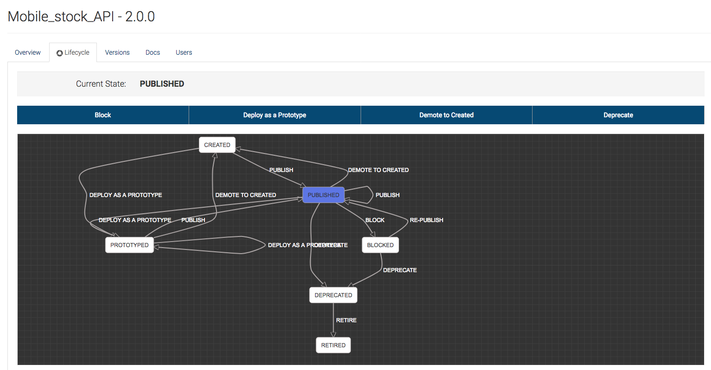

## API versioning
## Introduction
API versioning is a key functionality that needs to be addressed when the users, who are using a specific API for a long time. When introducing the new version of API the old API should also be supported for a specific time period. The time period is offered to the users of the old API to modify the availability of the new API and to make the transition. When the given time period ends, the old API can be retired. This feature allows users to manage multiple versions of same API at a given time.

## Buisiness Usecase Narrative
Lets take a scenario where user runs multiple version of same APIs in same runtime. When API creator created updated version of same existing API(version 1.0.0) he may need to create new version(version 1.1.0) of API. This new API might have few additional resources than the original API(which is version 1.0.0). If any new user need to use newly added API resources that user need to use 1.1.0 version of the API. Also in addition to that there might be some other use cases as well. Please see below business requirements. 
* Ability to retire old API(version 1.0.0) and introduce new versions(1.1.0, 1.1.1 etc) of API to enhance its functionality
* Ensure that API updates don’t break when upgraded/versioned or moved between environments, geographies, data centers and the cloud
* A/B testing with old vs new APIs
* Ability to notify consumers of the old version(version 1.0.0) about the availability of the new API version(whenever version 1.1.0 available to use)
* Enforcing a grace period to upgrade to the new version of the API
*Transferring contracts with app developers to newer versions.

## Persona
When it comes to API versining there can be muliple users associated with that story. 

## Implementation
ABC company is a mobile phone manufacturing company. They have a requirement to publish mobile phone prices through an API. When the industry grows with the prices, they need to publish some additional data such as a rating, user reviews of the mobile phones, etc. Users of the old API should know that there is a new API version released, and they need to be notified.
* We need an API to expose the mobile phone details of ABC company which will stand as the Old API
* We need to a new version of the above mentioned API to be state as the new API.
* We need the old API to be in published state and then once the new API version is created Old API should be in DEPRECATED state and the new versioned API should be in Published state.
* Subscribers of the Old API needs to get notified when the new API version is PUBLISHED.

### Prerequisites
In order to run this sample we will need to have API Manager 2.6.0 deployment. This deployment can be all in one node deployment or it can be a distributed API Manager deployment. Since provided sample is shell script user who test this flow should be able to execute shell script.

### Development 
For this particular sample there is no specific development to be done as provided sample script will perform all actions required for this usecase.

#### Sample configuration
No additional configuration or data to be added to servers.

### Deployment
API Manager 2.6.0 deployment required. No additional artifact or data to be added to servers.

### Testing and acceptance criteria
* Start the wso2am-2.6.0 distribution by executing [APIM_HOME]/bin/wso2server.sh or [APIM_HOME]/bin/wso2server.bat
* Run the file run.sh in sample scenarios root directory[APIM_HOME/sample-scenarios] as ./run.sh
Below are the screenshots that shows the OLD and New API’s with there lifecycle states.

Old API in DEPRECATED state

Old API in PUBLISHED state

## See also
[1] - https://docs.wso2.com/display/AM250/Enabling+Notifications

